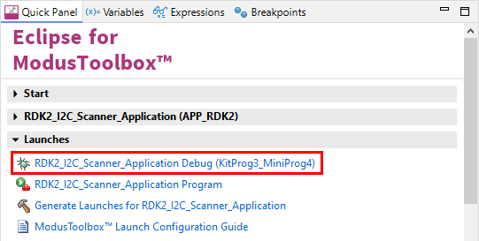

# RDK2 I2C Scanner

Rutronik Development Kit Programmable System-on-Chip CY8C6245AZI-S3D72 "I2C Scanner" Application. 

This application is used to find all the devices connected to the I2C.

 

## Requirements

- [ModusToolbox® software](https://www.infineon.com/cms/en/design-support/tools/sdk/modustoolbox-software/) v3.0

### Using the code example with a ModusToolbox IDE:

1. Import the project: **File** > **Import...** > **General** > **Existing Projects into Workspace** > **Next**.
2. Select the directory where **"RDK2_I2C_Scanner"** resides and click  **Finish**.
3. Update libraries using  a **"Library Manager"** tool.
4. Select and build the project **Project ** > **Build Project**.

### Operation

The application checks all the 127 addresses every second and reports all the devices responding to the I2C Start/Stop commands through the KitProg3 UART port. The RAB1-SENSORFUSION board was attached to the RDK2 during the test. If USB-C would be connected to the host with a power source, the on board USB-PD controller CYPD3177 would also respond with the 7-bit address: 0x08.

### Debugging

If you successfully have imported the application, the debug configurations are already prepared to use with a the KitProg3, MiniProg4, or J-link. Open the ModusToolbox perspective and find the **Quick Panel**. Click on the desired debug launch configuration and wait until the programming completes and debugging process starts.

## Legal Disclaimer

The evaluation board including the software is for testing purposes only and, because it has limited functions and limited resilience, is not suitable for permanent use under real conditions. If the evaluation board is nevertheless used under real conditions, this is done at one’s responsibility; any liability of Rutronik is insofar excluded. 

